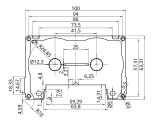

# OpenReel

## About

OpenReel is a project that aims to produce audio cassettes that are compatible to standard cassette tape players. It aims to be as 3D-printable as possible by including support structures for FDM printers whenever they are absolutely required.

Please note that OpenReel is currently in the dev-stage. It's not a working project but a fun project to work on, which is why I'm releasing it for you to tinker with.

If you want my measures of a cassette, here you go:

## Building an OpenReel cassette

### Requirements

* 3D printer (FDM recommended, resin in progress)
* 1/4 inch magnetic tape
* Some spongey-thing
* Glue
* Optional: 4 screws that kind of fit the model - you could always just use glue ;)

OpenReel uses 1/4 inch tape because it is readily available and only a little bigger in width than traditional cassette tape (which calims to be 1/8 inch but this is false...)

### Printing

All printable files are located in "Printables". Some objects are better printed using FDM, some using Resin:

| Object | Preferred Method | Reasoning |
| ------ | ------------------------- | --------- |
| Base   | FDM | Large flat object; little detail |
| Interface | FDM | Large flat object |
| Plug   | Resin | Very small object; May have bad adhesion |
| Roller | Resin | Surface should be smooth |
| Spool  | Resin | Small, detailed object with need for supports (inbuilt in FDM-files) |

Regardless of the printing method you should not need any additional supports.
For FDM you should also not need to change the orientation of any of the files.

All files need to be printed twice.

#### Using the STEP file

It's recommended that you import the "Cassette.step" file into your slicer. Most slicers will be able to handle STEP-files correctly.

PrusaSlicer for example allows you to import the file and then split it into individual objects using the respective button on the top bar. Split it and auto arrange it and voilà - the build plate is set up. You can also remove objects that you don't want to print right now.

My recommendation is to set the printer up for printing individual objects separately.

#### Using STL files

If you are more comfortable using STL files you can always just resort to the files in the STL-directory. Generally slicers will handle STEP files better as they preserve the actual shapes instead of breaking them down to triangles.

It's also more tedious once you are used to slicing STEP files containing all the parts ;)

### Building

Build instructions will follow soon. It's not that hard to figure it out though ;)

## Contributing and messing around

The project is available on Onshape. I chose Onshape because it is free, very usable and runs in a web browser making it compatible with linux.
Here is the project link: <https://cad.onshape.com/documents/349738425f2a45e8c18d34f4/>
